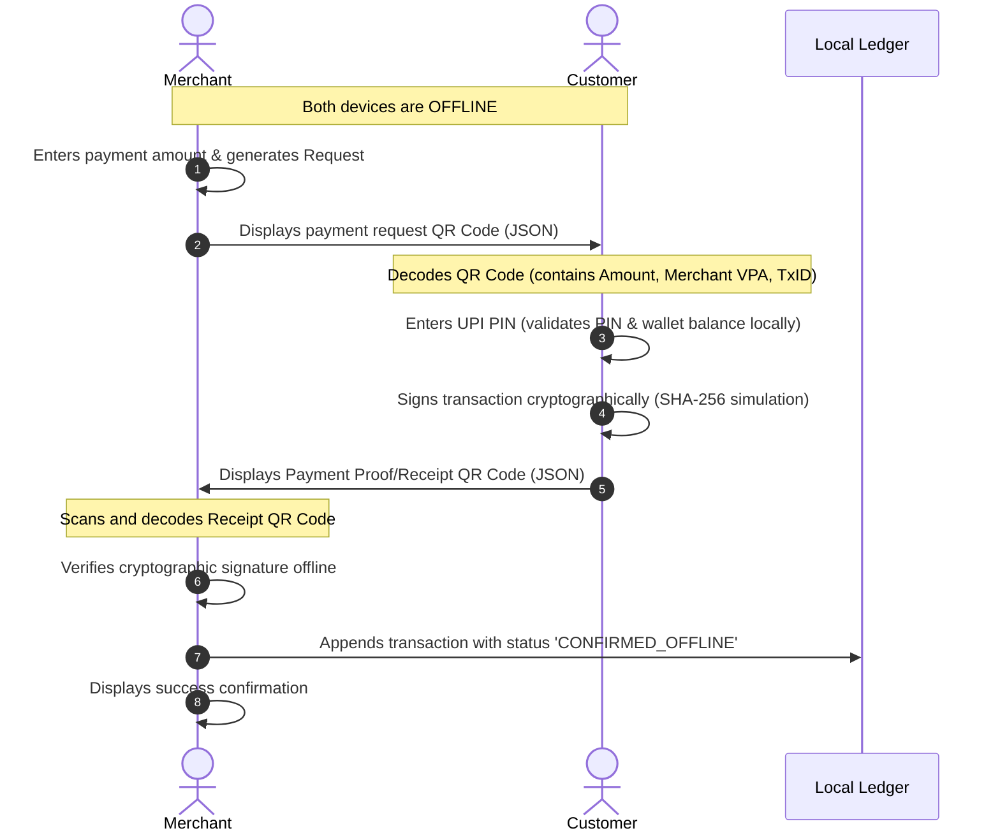

# OfflinePay: Internet-Free UPI Payment System
OfflinePay is a full-stack monorepo application designed to solve the problem of unreliable internet connectivity at points-of-sale (POS) and merchant locations. It simulates a secure, offline UPI-based payment system by implementing a local ledger, a mock bank, and a **Two-Way Cryptographic QR-Code Handshake Protocol**. 
With OfflinePay, users can load funds into an offline wallet while online and securely authorize and settle payments when network connectivity is completely down.
---
## 🏗️ System Architecture
OfflinePay operates as a monorepo consisting of a React + Vite frontend client and a Node.js + Express backend server acting as the banking service.
```mermaid
graph TD
    subgraph Client (Offline-Capable Browser)
        App[React App]
        Store[(Local Storage: History & Queue)]
        Crypto[Client-Side Crypto Engine]
        Sync[Sync Manager]
    end
    subgraph Server (Banking & Settlement System)
        API[Express App]
        DB[(JSON File DB: db.json)]
    end
    App <--> Store
    App --> Crypto
    App <--> Sync
    Sync <-->|HTTP API Calls| API
    API <--> DB
```
---
## 🔐 Cryptographic Two-Way Handshake Protocol
When offline, a secure transaction requires verification on both the merchant's device and the customer's device. OfflinePay implements a multi-step QR-based handshake:

### Protocol Steps:
1. **Initiate Request:** Bob (Merchant) wants to receive ₹120. He enters this in his app, generating a `PAY_REQ` payload containing:
   - `receiverVpa`: Bob's UPI ID (e.g., `canteen@offlinepay`)
   - `receiverName`: Bob's name
   - `amount`: `120`
   - `txId`: `TXN-XXXXXXXXXXXXX`
2. **Authorize Offline:** Alice (Customer) scans the QR code. The app decodes the details. Alice inputs her UPI PIN. The system validates the PIN locally, checks if Alice has $\geq$ ₹120 in her **Offline Wallet**, deducts ₹120 from her offline wallet balance, generates a unique receipt signature, and stores the transaction in her local queue with status `PENDING_SYNC`.
3. **Receipt Generation:** Alice's device displays a `PAY_PROOF` QR code containing the transaction details and the cryptographic signature:
   ```json
   {
     "type": "PAY_PROOF",
     "txId": "TXN-XXXXXXXXXXXXX",
     "senderVpa": "alice@offlinepay",
     "senderName": "Alice",
     "receiverVpa": "canteen@offlinepay",
     "amount": 120,
     "timestamp": "2026-06-30T17:20:00.000Z",
     "signature": "OP_SIG_A1B2C3D4_XXXXXX"
   }
   ```
4. **Offline Verification:** Bob scans Alice's QR code. His device verifies the cryptographic signature offline. Once validated, his app appends the transaction to his history with status `CONFIRMED_OFFLINE` and places it in his sync queue.
---
## ✨ Features
- **Simulated Network Toggle:** Easily toggle between online and offline modes to test system resilience.
- **Auto-Sync:** Periodically checks for internet availability and pushes pending offline queue items to the server ledger.
- **Manual Sync:** Trigger sync with a single click from the dashboard.
- **Secure Offline Wallet:** Load money from your bank account to your offline wallet while online.
- **Two-Way Offline Handshake:** Complete payments securely using dual QR codes (Request QR and Receipt QR).
- **Comprehensive Dashboard:** Shows mock bank balance, offline wallet balance, transaction logs, and sync status.
---
## 🛠️ Tech Stack & Dependencies
### Frontend Client (`/client`)
- **Framework:** React 19 + Vite
- **Styling:** CSS variables, responsive design, sleek glassmorphism dashboard
- **Icons:** [Lucide React](https://lucide.dev/)
- **QR Codes:** [qrcode.react](https://github.com/zpao/qrcode.react) for SVG rendering
### Backend Server (`/server`)
- **Runtime:** Node.js + Express
- **Mock Database:** Simple read-write file database (`db.json`)
- **Development Tool:** Nodemon (auto-restarting on changes)
---
## 📁 Repository Structure
```text
OfflinePay-UPI_Payment_System/
├── package.json              # Monorepo configuration and concurrently scripts
├── client/                   # Vite React Frontend
│   ├── src/
│   │   ├── utils/
│   │   │   ├── crypto.js       # Client-side cryptographic helper & validation
│   │   │   └── syncManager.js  # Local storage and server synchronization manager
│   │   ├── App.jsx             # Main dashboard UI and state controller
│   │   ├── index.css           # Vanilla CSS styling rules
│   │   └── main.jsx
│   └── package.json
└── server/                   # Express Backend
    ├── src/
    │   ├── db.js               # Mock database manager (file-based)
    │   ├── db.json             # Flat-file JSON database containing users and ledgers
    │   └── index.js            # Express API endpoints
    └── package.json
```
---
## 🔌 API Endpoints (Bank & Ledger Server)
|
 Route 
|
 Method 
|
 Description 
|
|
:---
|
:---
|
:---
|
|
`/api/health`
|
 GET 
|
 Check server connection status 
|
|
`/api/auth/register`
|
 POST 
|
 Register a new user VPA and auto-fund ₹10,000 in bank balance 
|
|
`/api/auth/login`
|
 POST 
|
 Authenticate user VPA and fetch balances 
|
|
`/api/wallet/balance`
|
 GET 
|
 Retrieve live bank and offline wallet balance 
|
|
`/api/wallet/fund`
|
 POST 
|
 Load money into offline wallet from bank account 
|
|
`/api/pay`
|
 POST 
|
 Real-time direct online settlement 
|
|
`/api/sync`
|
 POST 
|
 Synchronize client-side offline transaction queue with the server ledger 
|
|
`/api/history`
|
 GET 
|
 Fetch global transaction history for a user 
|
---
## 🚀 Getting Started
### 📋 Prerequisites
Make sure you have [Node.js](https://nodejs.org/) (v16+) and npm installed on your system.
### ⚙️ Installation & Running
1. **Clone the repository:**
   ```bash
   git clone https://github.com/pranavi66/OfflinePay-UPI_Payment_System.git
   cd OfflinePay-UPI_Payment_System
   ```
2. **Install all dependencies:**
   This command installs dependencies for both the `/client` and `/server` sub-folders concurrently:
   ```bash
   npm run install:all
   ```
3. **Start the application:**
   Launch the dev server (Express server running on port `5001` and Vite client on port `5173` or similar):
   ```bash
   npm run dev
   ```
---
## 🧪 Simulation Sandbox Accounts
The database is pre-configured with the following mock users. You can use them to test the two-way handshake:
|
 VPA (UPI ID) 
|
 Name 
|
 Password 
|
 UPI PIN 
|
 Default Bank Balance 
|
|
:---
|
:---
|
:---
|
:---
|
:---
|
|
`test@offlinepay`
|
 Test User 
|
`password`
|
`1234`
|
 ₹10,000.00 
|
|
`canteen@offlinepay`
|
 Campus Canteen 
|
`password`
|
`1234`
|
 ₹5,000.00 
|
|
`stationery@offlinepay`
|
 Stationery Mart 
|
`password`
|
`1234`
|
 ₹3,000.00 
|
### Recommended Walkthrough:
1. Log in with user `test@offlinepay` on one browser window.
2. Load ₹500 into your **Offline Wallet** using your UPI PIN (`1234`).
3. Open a second browser window (e.g. Incognito) and log in as `canteen@offlinepay` (Merchant).
4. On the Merchant window, click **Receive**, enter `120`, and generate the QR code.
5. In the User window, click **Pay**, toggle **Simulate Offline**, enter the payment details or scan/paste the generated JSON request.
6. Authorize with UPI PIN `1234`. The app deducts ₹120 locally and generates a proof QR code.
7. Paste/scan the proof JSON in the Merchant window. The Merchant validates the signature offline and approves.
8. Reconnect to the internet (untoggle offline), and watch both clients automatically synchronize their ledgers with the server!
